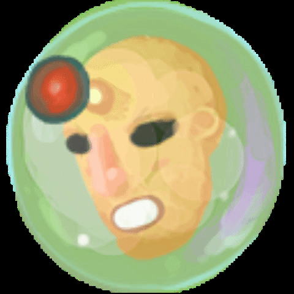
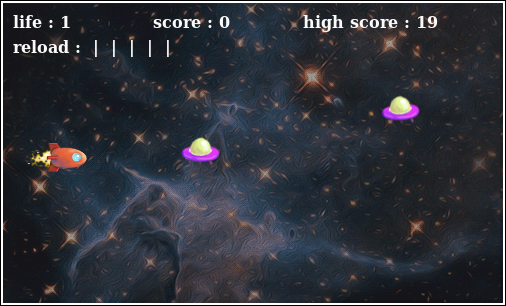

# 		Programmation WEB

## Présentation :

Ce repository représente le travail réalisé lors des Travaux Pratique de l'initiation au JavaScript. Vous trouverez le rendu des différentes scéances dans le dossier TP et le projet final dans le dossier Projet.

## Introduction au projet

Dans ce TP nous allons créer notre jeu à partir d'un code de base avec des assets disponible.

Le double objectif de ce Projet est à la fois de nous faire appliquer ce que nous avons vu lors des scéances de TP, mais aussi de s'entraîner à reprendre un code non commenté et que nous n'avons pas écrit.

J'ai décidé d'améliorer la base que nous avons eu pour la faire tendre vers un petit jeu web que j'aime bien qui est : https://zty.pe/ . Je veux donc que le rendu final ressemble le plus possible à ce genre de jeu.

## Idées d'option à ajouter :

- Comportements différents pour les soucoupes
- Game Over -> RAZ (appuyer sur escape pour reprendre)
- Tableau de score ?
- Boss de fin
- Aptitude supplémentaire (à récupérer)
- Écran de menu
- Ajout de musique et de SFX

## Liste des améliorations apportées

### 1ere amélioration : Ajout d'un menu

Dans un premier temps je vais rajouter un menu, pour cela je vais rajouter un boolean "gameRunning" qui indique si l'on est dans l'état "menu" ou dans l'état "jeu".

Ensuite je crée via une manipulation du DOM un écran de menu.

J'en profite pour ajouter un peu de CSS pour mettre la fenêtre de jeu au milieu de l'écran et mettre un fond noir à la page HTML. De plus, je fais commencer le jeu sur l'écran menu et je nous y fais revenir lorsque le joueur meurt.

**Résultat :**

### 2ème amélioration : Ajout de musique

Ajout de musique via le chargement de variable 'audio'.

### 3ème amélioration : Mise à jour des variables

Pour mettre à jour les variables, je déplace l'initialisation du nobre de point de vie du joueur dans la méthode init. Et je déplace l'initialisation du joueur et des ennemies dans une méthode "initGame" qui est lancé au démarrage depuis le menu.

### 4ème amélioration : Tableau de highscore

Dans un premier temps, j'ai voulu faire un tableau de highscore via un objet sérialisé en json. Après recherche, il se trouve qu'utiliser du json n'est pas très interressant car on n'a pas de serveur qui enverrait des données à notre client. Je vais donc pluot faire le stockage du score via le localStorage.

J'ai dû créer une fonction pour vérifier si le highscore était déjà définis pour éviter de le remettre à 0 à chaque fois qu'on refresh la page.

### 5ème amélioration : Ajout d'un ennemi

Je vias ajouter un ennemi qui avance tout droit.

### 6ème amélioration : Apparition aléatoire des ennemis

Je modifie la fonction qui gère l'ajout d'ennemi dans le tableau d'ennemi en ajoutant des ennemies en fonction du score du joueur et en ajoutant un peu d'aléatoire.

### 7ème amélioration : Ajout d'un boss

J'ajoute un boss qui se tiendra au milieu de l'écran, il tirera des boules qui suivront le joueur. Les boules seront tirées en rafale et s'arrêterons à un certain moment pour que le joueur puisse esquiver.

Sprite du boss :

Le boss n'apparaitera qu'une fois que le score du joueur sera supérieur à 10. Le boss aura un nombre de point de vie égal à 10.

### 8ème amélioration :  Ajout d'un temps de chargement entre chaque tir

Le jeu reste relativement facile, c'est pour cela que j'ai décidé qu'il pourrait être sympas de rajouter une barre de chargement au tir pour rajouter du challenge. Je rajoute donc une variable pour empécher de tirer et je met à jour un compteur de chargement.

